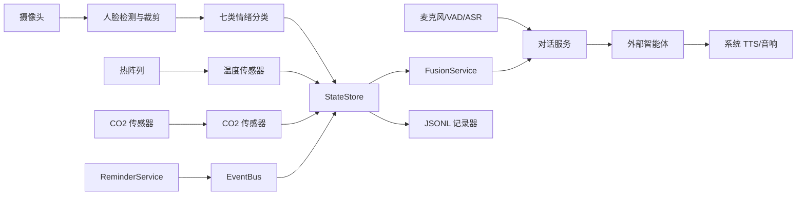

# 架构说明

## 运行边界

训练和推理严格分离。开发机负责 Ultralytics 训练、评估和 ONNX/NCNN 导出；Zero 2 W 只使用 OpenCV DNN 或候选 NCNN 后端加载导出模型。树莓派不需要 PyTorch、CUDA 或训练数据集。

`src/domain` 提供不可变读数、对话和快照契约。`StateStore` 原子保存最新快照；`EventBus` 对每个订阅者使用有界队列，慢消费者不会阻塞采集。`FusionService` 输出结构化上下文和本地高温/高 CO2 告警，且不作医学判断。

视觉链路先使用 Haar cascade 选取最大人脸，再将裁剪区域送入七类情绪 ONNX 分类器。没有检测到人脸时返回空读数，避免把背景误判为情绪；分类模型输出 logits 时由运行时执行稳定 softmax。模型标签顺序和校验值见 `data/models/README.md`。

## 组件替换与生命周期

`ComponentFactory` 通过白名单选择 mock 或真实实现。`runtime.mode: mock` 强制使用 mock，因此不导入相机、I2C、串口、Vosk 或真实网络组件。真实实现的硬件库在首次读取时延迟导入；设备故障应返回 `None` 或受控失败，而不是终止整个进程。

`Orchestrator` 使用固定命名线程运行视觉、热成像、CO2、提醒事件和可用对话服务。每个采集循环在 `Event.wait()` 上等待采样周期，单个组件异常被隔离。停止流程为：设置 Event、取消音频、在配置的有界超时内等待线程、关闭总线、记录器和设备。

Zero 2 W 的默认策略是 CPU、最大 320 像素输入、低 FPS、低频热成像/CO2 读取和延迟加载。实机基准必须记录 RSS、CPU、温度、FPS 和端到端延迟；目标峰值 RSS 不高于 350 MB，未达标时需降低输入尺寸或采样率并记录结果。

## 数据与隐私

领域读数携带带时区时间。JSONL 记录器按日期滚动且默认删除对话文本、原始音频和图像字段。日志不得输出完整转写、智能体回复、授权头、API 密钥或其他秘密。原始媒体默认不落盘。

提醒存储使用本地 JSON 与原子替换。智能体调用收到融合后的最小上下文与会话 ID；网络失败时对话服务播报本地短提示，提醒和本地安全规则无需云端即可继续运行。

## 配置和部署

从 `config/settings.example.yaml` 复制本机配置。配置路径相对于项目根目录解析；密钥通过环境变量名配置，并由 `/etc/dorm-assistant/dorm-assistant.env` 在 systemd 下提供。部署资产位于 `deploy/`，服务以 `dormassistant` 非 root 账户运行，内存上限为 400 MB。

交互式 `run --mock` 强制模拟组件；不带 `--mock` 时 CLI 使用配置中的真实驱动，供已配置的 systemd 单元调用。实际硬件和性能验收仍是独立前置条件，不能由服务成功安装替代。
